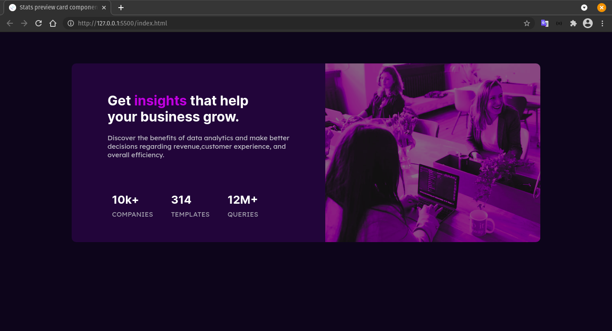

# Frontend Mentor - Stats preview card component solution

This is a solution to the [Stats preview card component challenge on Frontend Mentor](https://www.frontendmentor.io/challenges/stats-preview-card-component-8JqbgoU62). Frontend Mentor challenges help you improve your coding skills by building realistic projects. 

## Table of contents

- [Overview](#overview)
  - [The challenge](#the-challenge)
  - [Screenshot](#screenshot)
  - [Links](#links)
  - [Built with](#built-with)
  - [What I learned](#what-i-learned)
  - [Continued development](#continued-development)
- [Author](#author)

## Overview

### The challenge

Users should be able to:

- View the optimal layout depending on their device's screen size

### Screenshot

### Links

<!--Missing here-->

### Built with

- Semantic HTML5 markup
- CSS Flexbox

### What I learned

I put my knowledge in pratice, and i be able to uderstand how to structure better HTML elements to connect with CSS. I use some of BEM concepts to.

### Continued development

I want to pratice more about responsivity with images and texts, i am not confortable with the 'px' units and want to see a better unit option.

## Author

- GitHub - [@Jesse-Snow](https://github.com/Jesse-Snow)
- Frontend Mentor - [@Jesse-Snow](https://www.frontendmentor.io/profile/Jesse-Snow)
